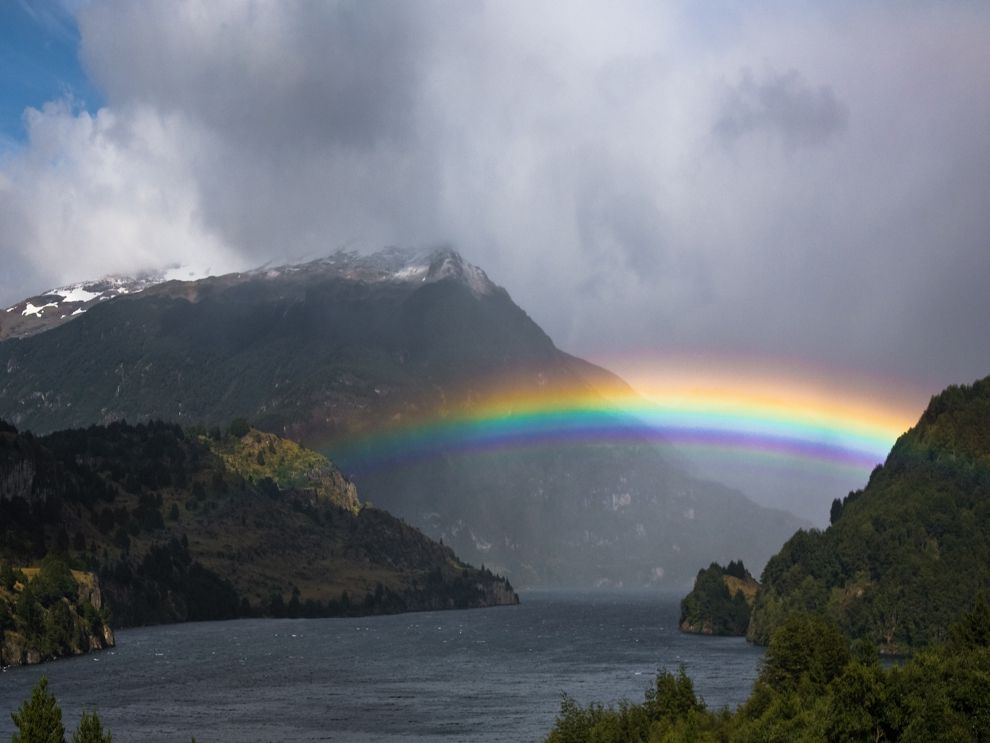

# hello-world

## Hi Humans!

Hubot here, I like Node.js and Coffeescript (that's what I'm made of!).
I've had tacos on the moon and find them far superior to Earth tacos.

I found this equation useful:


It's very easy to make some words **bold** and other words *italic* with markdown. You can even
[link to google](http://google.com).

A song about rainbows in the key of G major. <br>


## This is a second-tier heading

You can use one `#` all the way up to `######` six for different heading sizes.

If you'd like to quote someone, use the > character before the line:

> Coffee. The finest organic suspension ever devised... I beat the borg with it.
>
> \- Captain Janeway

## Code

There are many different ways to style code with Github's markdown. If you have inline code blocks, wrap them in backticks: `var example = true`. If you've got a longer block of code, you can indent with four spaces:

    if (isAwesome) {
      return true
    }

Github also supports something called code fencing, which allows for multiple lines without indentation:

```
if (isAwesome) {
  return true
}
```

And if you'd like to use syntax highlighting, include the language:

```python
def factorial(n):
  if n < 1:
    return 1
  return n + factorial(n - 1)
```

## Lists

### Unordered
* Item 1
* Item 2
    * Item 2a
    * Item 2b

### Ordered
1. Item 1
1. Item 2
1. Item 3
    1. Item 3a
    1. Item 3b

## Rainbow River



> Photograph by David Armstrong, MyShot
>
> A rainbow is a multicolored arc made by light striking water droplets. The most familiar type rainbow, including this one in southern Chile, is produced when sunlight strikes raindrops in front of a viewer at a precise angle. The colors on a primary rainbow are always in order of their wavelength, from longest to shortest: red, orange, yellow, green, blue, and violet.

## Task Lists

- [x] @mentions, #refs, [links](images/rainbow_natgeo.jpg), **formatting**, and <del>tags</del> supported
- [x] list syntax required (any unordered or ordered list supported)
- [x] this is a complete item
- [ ] this is an incomplete item

If you include a task list in the first comment of an issue, you will get a handy progress indicator in your issue list. It also works in Pull Requests!

## Tables

You can create tables by assembling a list of words and dividing them with hypens `-` (for the first row), and then separating each column with a pipe `|`:

First Header | Second Header
-------------|--------------
Content from cell 1 | Content from cell 2
Content in the first column | Content in the second column


## Strikethrough

Any word wrapped with two tildes like `~~this~~` will appear crossed out.

Example: ~~crossed~~
